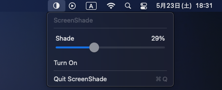

# OpenMacScreenShade

A tiny macOS menu bar app that dims your screen with a click-through black overlay.
The app is located at right top menu.





No hardware brightness control. No DDC/CI. No gamma changes. No private APIs. No permissions. No network access.

## Download and Run

1. Download `ScreenShade.app` from the GitHub Releases page.
2. Move it to `/Applications`.
3. Open it.
4. Use the menu bar icon to turn shading on, adjust opacity, turn it off, or quit.

ScreenShade starts with shading OFF every time.

If macOS blocks the first launch, right-click the app in Finder and choose **Open**.

## Safety

- Starts with shading OFF.
- Restores only the previous opacity slider value.
- Does not restore the previous ON/OFF state.
- Caps opacity at 85%, so the screen never becomes fully black.
- Overlays are click-through and do not block mouse input.
- Turning OFF or quitting closes all overlay windows.
- No telemetry, analytics, updater, login item, global shortcut, or network code.

## Compatibility

Requires macOS 15.0 or later.

Tested on macOS 15.7.

Expected to work on Intel and Apple Silicon Macs because the app uses standard AppKit screen APIs and does not depend on monitor hardware control.

Not supported:

- Windows
- Linux
- iPad
- macOS versions older than 15.0
- Hardware monitor brightness control
- DDC/CI
- Gamma table changes

## Build from Source

```bash
swift test
./build.sh
open build/ScreenShade.app
```

`build.sh` creates a Universal Binary app containing both `x86_64` and `arm64`, verifies it with `lipo`, and applies ad-hoc codesigning.

## Report Compatibility

Compatibility reports are welcome. Please include:

- Mac model
- Intel or Apple Silicon
- macOS version
- Built-in or external display
- Number of displays
- Whether full-screen apps were tested
- Whether Stage Manager was tested
- Result

Only attach screenshots if they are safe to share.

## License

MIT License. See `LICENSE`.
